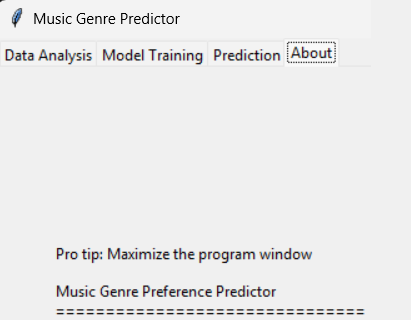

# Music Genre Predictor

A comprehensive machine learning application that predicts music genre preferences based on demographic data.



## Overview

This application demonstrates a complete machine learning workflow for predicting music genre preferences based on demographic factors like age and gender. Built with Python and Tkinter, it provides an intuitive interface for exploring data, training models, and making predictions.

## Features

- **Data Analysis**: Load and visualize your dataset with detailed statistics and graphs
- **Model Training**: Train and evaluate multiple machine learning algorithms
- **Prediction**: Make predictions based on user input and view common patterns
- **Data Handling**: Comprehensive handling of missing values and outliers
- **Model Storage**: Save and load trained models for future use

## Machine Learning Algorithms

The application implements three different algorithms:
- **Gaussian Naive Bayes**: Effective for small datasets and works well with categorical data
- **K-Nearest Neighbors**: Good for classification where similar examples have similar outcomes
- **Random Forest**: Robust against outliers and overfitting, providing high accuracy in many scenarios

## Requirements

- Python 3.7+
- Required packages:
  - pandas
  - numpy
  - matplotlib
  - seaborn
  - scikit-learn
  - tkinter (usually included with Python)

```bash
pip install pandas numpy matplotlib seaborn scikit-learn
```

## Installation

1. Clone this repository:
```bash
git clone https://github.com/nextstep7/6.git
```

2. Install dependencies:
```bash
pip install -r requirements.txt
```

## Usage

Run the application:
```bash
python music_trainer.py
```

### Data Analysis Tab
- Load your own CSV data or use the built-in default dataset
- View dataset statistics and visualizations
- Analyze data quality including checking for missing values and outliers

### Model Training Tab
- Select a machine learning algorithm
- Set test/train split ratio
- Train the model and view performance metrics
- Save the trained model for future use

### Prediction Tab
- Input age and gender to get a predicted music genre preference
- View confidence levels for predictions
- Explore common patterns found in the data

## Dataset Format

Your CSV file should include at least these columns:
- `age`: Numeric age value
- `gender`: Binary indicator (0 for female, 1 for male)
- `genre`: Music genre category (target variable)

Example:
```
age,gender,genre
24,1,HipHop
31,0,Classical
27,1,Jazz
```

## Contributing

Contributions are welcome! Please feel free to submit a Pull Request.

## License

This project is licensed under the MIT License - see the LICENSE file for details.

## Acknowledgments

- The application was developed as part of a Python and Machine Learning course
- Implements visualization techniques with Matplotlib and Seaborn
- Uses Scikit-learn for machine learning algorithms
